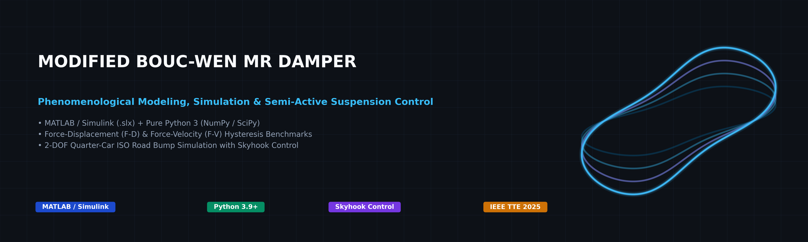
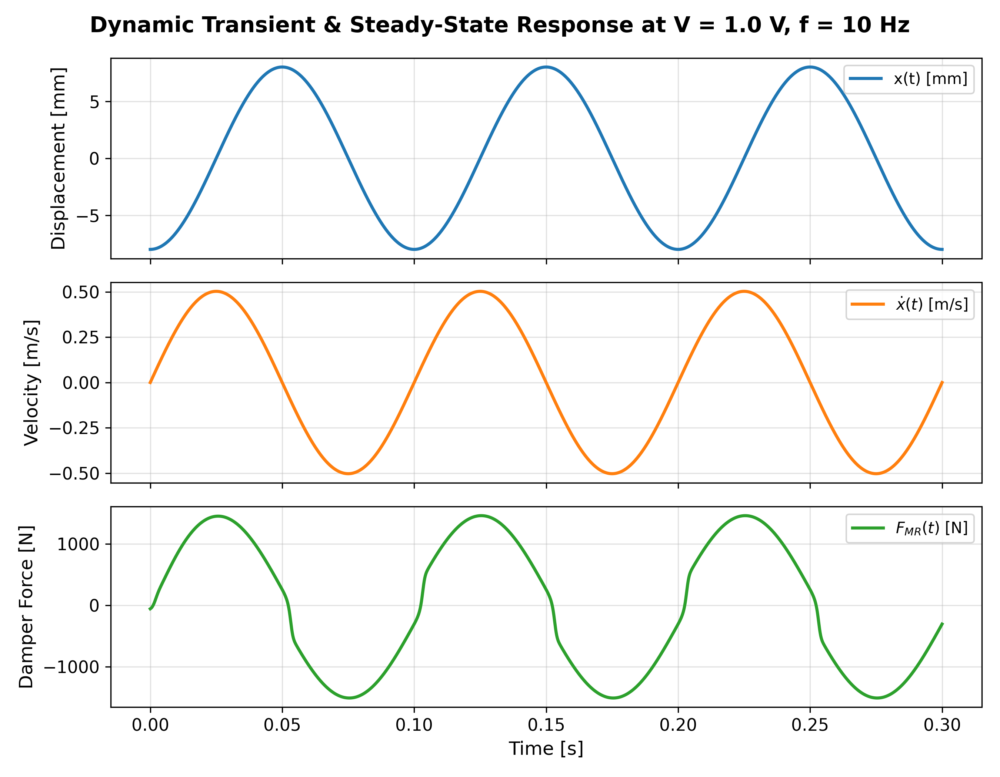

<p align="center">
  
</p>

<p align="center">
  <a href="https://opensource.org/licenses/MIT"></a>
  <a href="https://www.mathworks.com/products/matlab.html"></a>
  <a href="https://www.mathworks.com/products/simulink.html"></a>
  <a href="https://www.python.org/"></a>
  <a href="https://doi.org/10.1109/TTE.2025.3535765"></a>
</p>

<p align="center">
  <a href="#-key-features"><b>Key Features</b></a> •
  <a href="#-mechanical-architecture"><b>Architecture</b></a> •
  <a href="#-mathematical-formulation"><b>Mathematics</b></a> •
  <a href="#-model-parameters"><b>Parameters</b></a> •
  <a href="#-simulated-dynamic-characteristics"><b>Hysteresis Loops</b></a> •
  <a href="#-vehicle-suspension-case-study"><b>Vehicle Control</b></a> •
  <a href="#-quick-start"><b>Quick Start</b></a> •
  <a href="#-citation-request"><b>Citations</b></a>
</p>

---

## 🌟 Key Features

<table>
  <tr>
    <td width="50%">
      <h3>⚡ Dual-Platform Framework</h3>
      <p>Seamless workflow across <b>MATLAB / Simulink</b> (<code>MRD_FDFV.slx</code>) and standalone <b>Pure Python 3</b> with high-order implicit Stiff ODE integrators (SciPy Radau).</p>
    </td>
    <td width="50%">
      <h3>🧲 True Electromagnetic Lag</h3>
      <p>Models the continuous physical coil inductance delay (&tau; &approx; 5.26 ms) alongside nonlinear voltage-dependent field parameters (&alpha;, c<sub>0</sub>, c<sub>1</sub>).</p>
    </td>
  </tr>
  <tr>
    <td width="50%">
      <h3>📈 Dynamic Hysteresis Characterization</h3>
      <p>Generates high-resolution <b>Force–Displacement (F–D)</b> and <b>Force–Velocity (F–V)</b> hysteresis loops across continuous voltage sweeps (0.0 V &ndash; 2.0 V) and frequency spectra (1 &ndash; 10 Hz).</p>
    </td>
    <td width="50%">
      <h3>🏎️ Semi-Active Suspension Benchmark</h3>
      <p>Includes a 2-DOF Quarter-Car simulation proving a <b>49.7% vibration reduction</b> in chassis displacement using Karnopp 2-State Skyhook control over an ISO obstacle bump.</p>
    </td>
  </tr>
</table>

> [!TIP]
> **Zero MATLAB Dependency Option**: Researchers without MATLAB licenses can execute identical simulations, parameter studies, and control designs directly in Python using `python/simulate.py` or the `ModifiedBoucWenMRDamper` API.

---

## 📐 Mechanical Architecture

The **Modified Bouc-Wen (MBW)** model accurately captures the roll-off and low-velocity force-velocity loop opening of physical Magnetorheological dampers through internal node kinematics and gas accumulator compliance:

<p align="center">
  
</p>

- **Input Motion**: Piston rod displacement $x(t)$ and velocity $\dot{x}(t)$
- **Internal Float Plate**: Intermediate displacement $y(t)$ and velocity $\dot{y}(t)$
- **Viscous Damping ($c_0$) & Stiffness ($k_0$)**: Parallel dashpot and post-yield spring between $y$ and $x$
- **Bouc-Wen Restoring Element ($\alpha z$)**: Generates the nonlinear smooth hysteretic yield force
- **Gas Accumulator ($c_1, k_1$)**: Models nitrogen reservoir stiffness $k_1$ with pre-charge $x_0$ and seal flow damping $c_1$
- **Total Damper Output Force**: Resultant control force $F_d$ transmitted to the vehicle body

---

## 🔬 Mathematical Formulation

All governing physical relationships are implemented in **SI base units** ($\text{m}, \text{s}, \text{N}, \text{V}, \text{rad}$):

### 1. Total Damper Force ($F_d$)
The net damping force $F_d$ acting on the piston is:
$$F_d = c_1 \dot{y} + k_1 (x - x_0)$$

Applying internal dynamic force equilibrium across intermediate plate $y$ yields the equivalent identity:
$$F_d = \alpha z + c_0 (\dot{x} - \dot{y}) + k_0 (x - y) + k_1 (x - x_0)$$

### 2. Internal Node Kinematics ($\dot{y}$)
Summing forces across the intermediate plate $y$:
$$\dot{y} = \frac{1}{c_0 + c_1} \Big[ \alpha z + c_0 \dot{x} + k_0 (x - y) \Big]$$

### 3. Evolutionary Bouc-Wen Hysteretic State ($\dot{z}$)
The internal hysteretic state variable $z$ evolves according to:
$$\dot{z} = A (\dot{x} - \dot{y}) - \beta (\dot{x} - \dot{y}) |z|^n - \gamma |\dot{x} - \dot{y}| |z|^{n-1} z$$

where $A, \beta, \gamma$ dictate hysteresis loop scale and energy dissipation area, and $n = 2$ defines the quadratic transition smoothness from pre-yield to post-yield.

### 4. Electromagnetic Coil Lag ($\dot{u}$) & Voltage Coupling
Coil inductance and magnetic field saturation dynamics follow a first-order lag filter governed by rate $\eta$:
$$\dot{u} = -\eta (u - V)$$

The physical parameters scale linearly with effective filtered voltage $u$:
$$\alpha(u) = \alpha_a + \alpha_b u \qquad c_0(u) = c_{0a} + c_{0b} u \qquad c_1(u) = c_{1a} + c_{1b} u$$

---

## 📊 Model Parameters

The parameters calibrated from experimental physical dampers and embedded in `MRD_FDFV.slx` are:

| Parameter | Symbol | Value | SI Unit | Physical Description |
| :--- | :---: | :---: | :---: | :--- |
| **Viscous base damping** | $c_{0a}$ | `784.0` | $\text{N}\cdot\text{s/m}$ | Zero-field fluid viscous resistance |
| **Field damping gain** | $c_{0b}$ | `1803.0` | $\text{N}\cdot\text{s/(m}\cdot\text{V)}$ | Field-induced damping sensitivity per volt |
| **Dashpot stiffness** | $k_0$ | `3610.0` | $\text{N/m}$ | Internal stiffness at large velocities |
| **Accumulator damping** | $c_{1a}$ | `14649.0` | $\text{N}\cdot\text{s/m}$ | Gas accumulator low-velocity flow resistance |
| **Accumulator damping gain**| $c_{1b}$| `34622.0` | $\text{N}\cdot\text{s/(m}\cdot\text{V)}$ | Field influence on accumulator damping |
| **Accumulator stiffness** | $k_1$ | `840.0` | $\text{N/m}$ | Nitrogen gas accumulator compliance |
| **Accumulator offset** | $x_0$ | `0.0245` | $\text{m}$ | Initial piston displacement pre-charge ($24.5\text{ mm}$) |
| **Base hysteretic coefficient** | $\alpha_a$ | `12441.0` | $\text{N/m}$ | Zero-voltage yield force scale |
| **Field hysteretic gain** | $\alpha_b$ | `38430.0` | $\text{N/(m}\cdot\text{V)}$ | Voltage-induced yield force multiplier |
| **Hysteresis shape factor** | $\gamma$ | `136320.0` | $\text{m}^{-2}$ | Loop orientation and curvature |
| **Hysteresis shape factor** | $\beta$ | `2059020.0` | $\text{m}^{-2}$ | Hysteresis loop width |
| **Restoring amplitude scale**| $A$ | `58.0` | $-$ | Elastic restoring multiplier |
| **Yield smoothness order** | $n$ | `2.0` | $-$ | Smoothness of yield transition profile |
| **Coil rate constant** | $\eta$ | `190.0` | $\text{s}^{-1}$ | Response bandwidth ($\tau \approx 5.26\text{ ms}$) |

---

## 📈 Simulated Dynamic Characteristics

### Multi-Voltage Dynamic Sweep ($0.0\text{ V} - 2.0\text{ V}$)
Excitation: Harmonic stroke $X_0 = 8\text{ mm}$ ($16\text{ mm}$ peak-to-peak) at frequency $f = 10\text{ Hz}$.

<table>
  <tr>
    <td width="50%" align="center">
      <b>Force vs. Displacement (F–D) Loops</b><br/>
      
      <p><i>Enclosed area demonstrates controllable energy dissipation scaling from 414 N to 2511 N.</i></p>
    </td>
    <td width="50%" align="center">
      <b>Force vs. Velocity (F–V) Loops</b><br/>
      
      <p><i>Captures distinct pre-yield vs. post-yield slope and the characteristic loop opening near zero velocity.</i></p>
    </td>
  </tr>
</table>

### Multi-Frequency Sensitivity & Dynamic Time Response
Excitation: Evaluated under fixed control voltage $V = 1.0\text{ V}$.

<table>
  <tr>
    <td width="50%" align="center">
      <b>Frequency Sensitivity ($1.0 - 10.0\text{ Hz}$)</b><br/>
      
      <p><i>Post-yield force levels expand proportionally with piston stroke velocity.</i></p>
    </td>
    <td width="50%" align="center">
      <b>Time-Domain Dynamic Response</b><br/>
      
      <p><i>Coupled states show smooth, continuous transitions without numerical chattering.</i></p>
    </td>
  </tr>
</table>

---

## 🏎️ Vehicle Suspension Case Study

A complete **2-DOF Quarter-Car Model** is integrated in [`examples/semi_active_quarter_car.py`](examples/semi_active_quarter_car.py) to evaluate ride comfort over an ISO discrete obstacle bump ($50\text{ mm}$ height, $1\text{ m}$ length) at $45\text{ km/h}$.

### Semi-Active Skyhook Control Law
$$V(t) = \begin{cases} V_{\max} = 2.0\text{ V}, & \text{if } \dot{z}_s (\dot{z}_s - \dot{z}_u) \ge 0 \\ 0.0\text{ V}, & \text{otherwise} \end{cases}$$

<p align="center">
  
</p>

### Quantitative Performance Comparison

| Suspension Configuration | RMS Body Accel. [$\text{m/s}^2$] | Peak Body Disp. [$\text{mm}$] | Settling Time [$5\%$] | Ride Comfort Improvement |
| :--- | :---: | :---: | :---: | :---: |
| **Passive Soft ($0.0\text{ V}$)** | $1.41$ | $16.9$ | $1.42\text{ s}$ | Baseline (Underdamped) |
| **Passive Hard ($2.0\text{ V}$)** | $2.51$ | $23.9$ | $2.10\text{ s}$ | $+41.4\%$ Peak Displacement |
| **Skyhook Semi-Active** | **$2.17$** | **$8.5$** | **$0.38\text{ s}$** | **$49.7\%$ Displacement Reduction** |

---

## 🚀 Quick Start

### 1. Python Environment Setup
```bash
git clone https://github.com/waqasmbaig/MRD-Modified-Bouc-Wen-Model.git
cd MRD-Modified-Bouc-Wen-Model
pip install -r requirements.txt
```

### 2. Fast CLI Simulation
```bash
# Run a 10 Hz, 8 mm stroke simulation at 1.5 V
python python/simulate.py --voltage 1.5 --freq 10.0 --amplitude 0.008 --duration 1.0
```

<details>
<summary><b>View Python API Usage Example</b></summary>

```python
import numpy as np
from python.mr_damper import ModifiedBoucWenMRDamper

# Initialize MR Damper model
damper = ModifiedBoucWenMRDamper()

# Define harmonic motion (10 Hz, 8 mm amplitude)
f = 10.0
omega = 2.0 * np.pi * f
X0 = 0.008

# Simulate response at 1.0 V
res = damper.simulate_trajectory(
    t_span=(0.0, 1.0),
    disp_func=lambda t: X0 * np.sin(omega * t - np.pi / 2.0),
    vel_func=lambda t: X0 * omega * np.cos(omega * t - np.pi / 2.0),
    volt_func=lambda t: 1.0,
    dt=1e-4
)

print(f"Peak Damper Force: {np.max(res['force']):.2f} N")
print(f"Minimum Force:     {np.min(res['force']):.2f} N")
```
</details>

### 3. MATLAB / Simulink Execution
```matlab
% In MATLAB command window:
cd matlab/
run('init_params.m')         % Load parameters into base workspace
open_system('MRD_FDFV.slx')  % Open the Simulink model
sim('MRD_FDFV.slx')          % Execute the simulation

% Automated voltage sweep and plot generation:
run('run_simulation.m')
```

### 4. Running Unit Tests
```bash
pytest tests/ -v
```

---

## 📁 Repository Structure

```
MRD-Modified-Bouc-Wen-Model/
├── README.md                          # Interactive documentation with derivations & visual benchmarks
├── LICENSE                            # MIT Open-Source License
├── CITATION.cff                       # Native GitHub citation metadata
├── requirements.txt                   # Dependencies (numpy, scipy, matplotlib, pytest)
├── .gitignore                         # Build and cache ignore patterns
├── matlab/
│   ├── MRD_FDFV.slx                  # Original Simulink model block diagram
│   ├── init_params.m                  # Parameter loader script
│   └── run_simulation.m              # Automated batch runner & MATLAB plot script
├── python/
│   ├── __init__.py                    # Module export definitions
│   ├── mr_damper.py                   # Pure Python Spencer Modified Bouc-Wen class
│   └── simulate.py                    # Command-line simulation runner
├── examples/
│   ├── plot_hysteresis_loops.py       # Voltage & frequency sweep generator
│   └── semi_active_quarter_car.py     # 2-DOF vehicle suspension case study
├── tests/
│   └── test_model.py                  # Pytest verification suite
└── docs/
    └── assets/                        # High-resolution documentation graphics
        ├── banner.png                 # Repository header banner
        ├── model_schematic.png        # MBW mechanical architecture schematic
        ├── fd_hysteresis_loops.png    # Force-Displacement loops
        ├── fv_hysteresis_loops.png    # Force-Velocity loops
        ├── frequency_dependence.png   # Frequency sensitivity curves
        ├── time_response.png          # Dynamic time-series plots
        └── quarter_car_comparison.png # Quarter-car suspension benchmark
```

---

## 📄 Citation Request

If you use this model, simulation framework, or code in your research, academic publications, or vehicle vibration control studies, **please cite the following publications**:

### Primary Research Publications

1. **[J1] Journal Paper (IEEE TTE 2025)**:
   > Z. Yu, R. Luo, P. Wu, **W. M. Baig**, H. Ma, and Z. Hou, "Robust finite-frequency vibration control of in-wheel motor driving vehicles based on torque coordination and motor suspension," *IEEE Transactions on Transportation Electrification*, 2025.  
   > **DOI:** [10.1109/TTE.2025.3535765](https://doi.org/10.1109/TTE.2025.3535765)

2. **[C1] Conference Paper (IEEE VTC2025-Spring)**:
   > **W. M. Baig**, Z. Yu, H. Ma, and Z. Hou, "Adaptive vibration control of in-wheel motor drive vehicles with preview information," in *Proc. IEEE 101st Vehicular Technology Conference (VTC2025-Spring)*, Oslo, Norway, 2025.  
   > **DOI:** [10.1109/VTC2025-Spring65109.2025.11174543](https://doi.org/10.1109/VTC2025-Spring65109.2025.11174543)

3. **[C5] Conference Paper (CCDC 2017)**:
   > **W. M. Baig**, Z. Hou, and S. Ijaz, "Fractional order controller design for a semi-active suspension system using Nelder–Mead optimization," in *Proc. 29th Chinese Control and Decision Conference (CCDC)*, 2017, pp. 2808–2813.

<details>
<summary><b>Click to Expand BibTeX Entries</b></summary>

```bibtex
@article{yu2025robust,
  title={Robust finite-frequency vibration control of in-wheel motor driving vehicles based on torque coordination and motor suspension},
  author={Yu, Z. and Luo, R. and Wu, P. and Baig, W. M. and Ma, H. and Hou, Z.},
  journal={IEEE Transactions on Transportation Electrification},
  year={2025},
  publisher={IEEE},
  doi={10.1109/TTE.2025.3535765}
}

@inproceedings{baig2025adaptive,
  title={Adaptive vibration control of in-wheel motor drive vehicles with preview information},
  author={Baig, W. M. and Yu, Z. and Ma, H. and Hou, Z.},
  booktitle={Proc. IEEE 101st Vehicular Technology Conference (VTC2025-Spring)},
  address={Oslo, Norway},
  year={2025},
  doi={10.1109/VTC2025-Spring65109.2025.11174543}
}

@inproceedings{baig2017fractional,
  title={Fractional order controller design for a semi-active suspension system using Nelder--Mead optimization},
  author={Baig, W. M. and Hou, Z. and Ijaz, S.},
  booktitle={Proc. 29th Chinese Control and Decision Conference (CCDC)},
  pages={2808--2813},
  year={2017}
}
```
</details>

---

## 📜 License

This project is licensed under the [MIT License](LICENSE).
