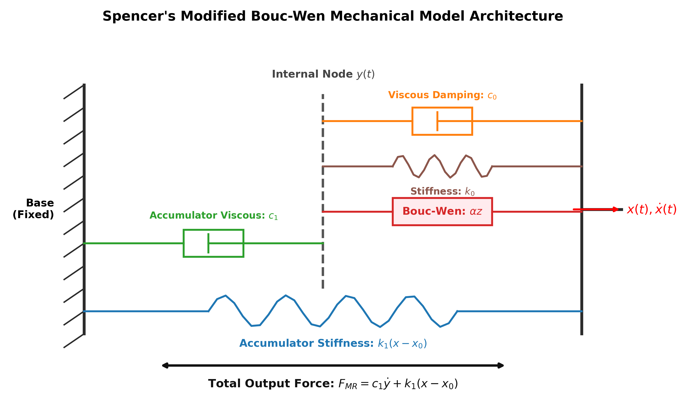
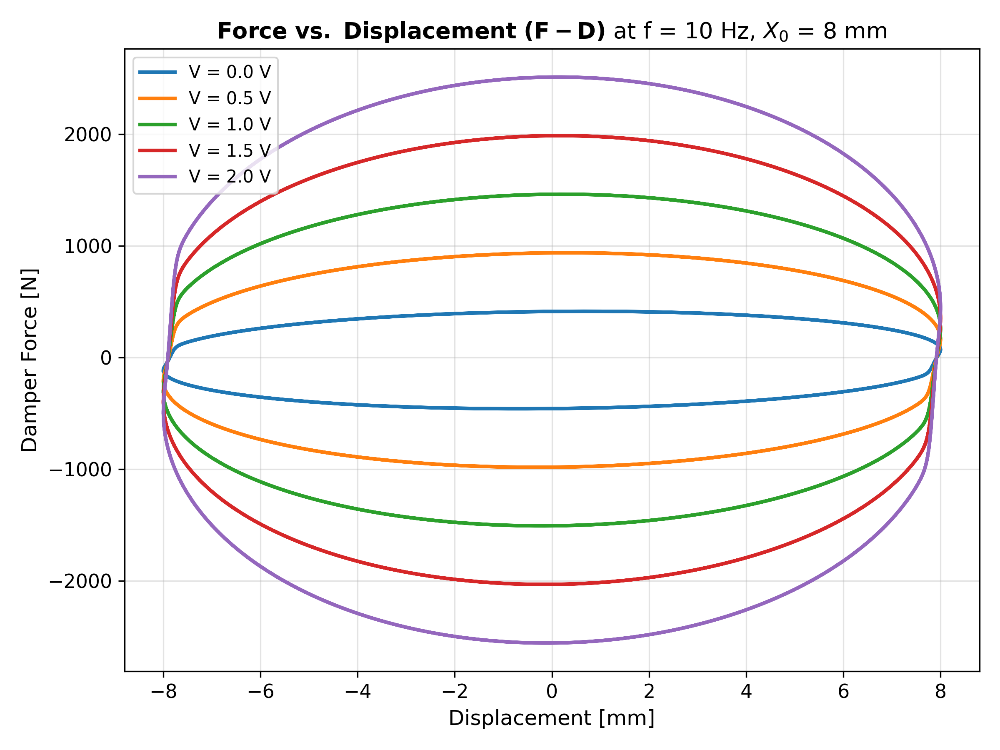
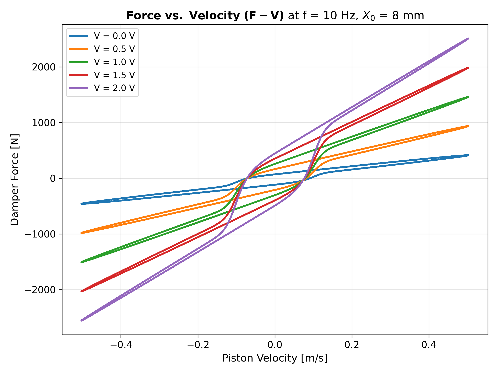
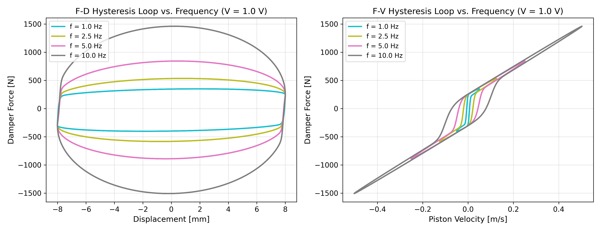
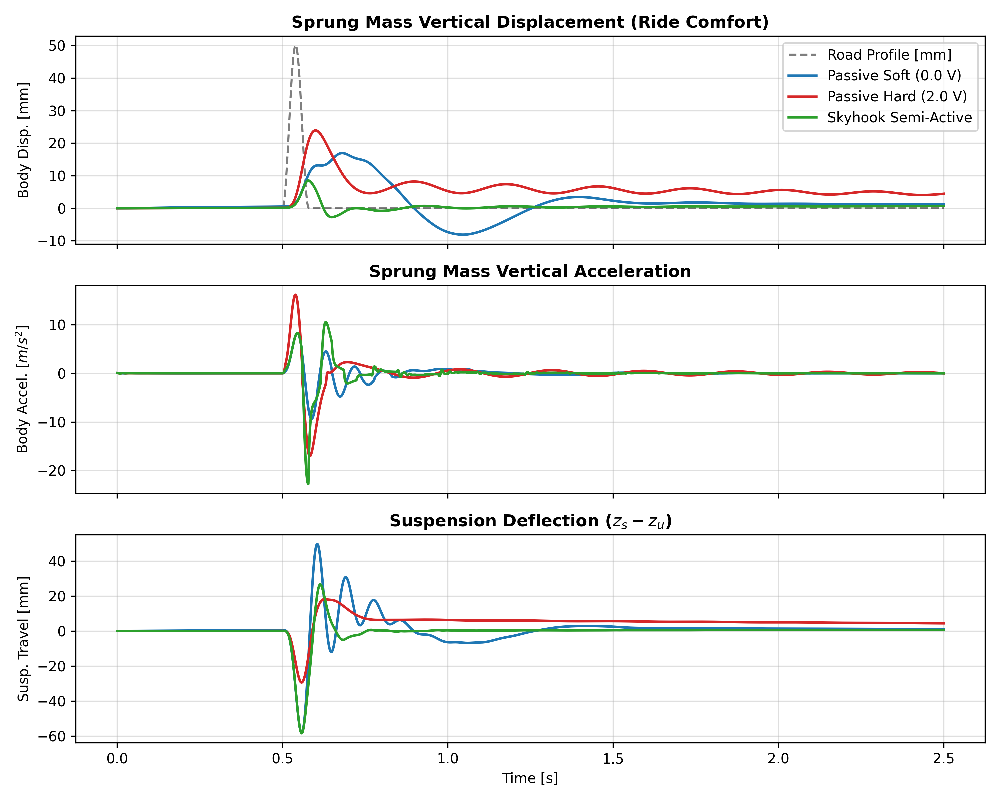

# Modified Bouc-Wen Magnetorheological (MR) Damper Model

[](https://opensource.org/licenses/MIT)
[](https://www.mathworks.com/products/matlab.html)
[](https://www.mathworks.com/products/simulink.html)
[](https://www.python.org/)
[](tests/test_model.py)

A high-fidelity implementation, simulation harness, and validation benchmark for **Spencer et al.'s Phenomenological Modified Bouc-Wen Model** of a Magnetorheological (MR) fluid damper.

This repository provides both the **MATLAB / Simulink** block diagram model (`MRD_FDFV.slx`) and a pure **Python (SciPy / NumPy)** object-oriented implementation, complete with Force–Displacement ($F-D$) and Force–Velocity ($F-V$) hysteresis generation, unit tests, and a 2-DOF quarter-car semi-active suspension case study.

---

## Table of Contents

- [Overview & Physics](#overview--physics)
- [Mechanical Architecture](#mechanical-architecture)
- [Mathematical Formulation](#mathematical-formulation)
- [Model Parameters](#model-parameters)
- [Simulated Dynamic Characteristics](#simulated-dynamic-characteristics)
- [Application: Semi-Active Vehicle Suspension (Skyhook)](#application-semi-active-vehicle-suspension-skyhook)
- [Repository Structure](#repository-structure)
- [Quick Start: MATLAB & Simulink](#quick-start-matlab--simulink)
- [Quick Start: Python Package](#quick-start-python-package)
- [Unit Testing & Verification](#unit-testing--verification)
- [How to Push / Upload to GitHub](#how-to-push--upload-to-github)
- [References & Citation](#references--citation)
- [License](#license)

---

## Overview & Physics

Magnetorheological (MR) dampers are semi-active actuators containing a carrier fluid (typically synthetic oil) suspended with micron-sized ferromagnetic iron particles. When an electromagnetic coil applies a magnetic field:
1. The particles align along flux lines into columnar chain structures within milliseconds.
2. The fluid undergoes a reversible phase transition from Newtonian viscous liquid to a non-Newtonian viscoplastic Bingham plastic with high yield shear strength.
3. Controlling the applied coil voltage ($0 - 2\text{ V}$) modulates damping force dynamically over a broad dynamic range.

The classical Bouc-Wen model captures basic hysteresis, but fails to reproduce the roll-off and force-velocity loop opening at low velocities observed in physical dampers. The **Modified Bouc-Wen model (Spencer et al., 1997)** solves this by introducing:
- An internal intermediate displacement node $y$
- An accumulator stiffness $k_1$ with offset $x_0$ modeling gas bladder expansion
- Accumulator viscous damping $c_1$
- A first-order electromagnetic coil dynamics filter $\eta$

---

## Mechanical Architecture

The mechanical analog represents the damper through five coupled components:



- **Input Shaft Motion**: Piston displacement $x(t)$ and velocity $\dot{x}(t)$
- **Internal Float Node**: Internal displacement $y(t)$ and velocity $\dot{y}(t)$
- **Viscous Damping ($c_0$) & Stiffness ($k_0$)**: Dashpot and spring in parallel with Bouc-Wen element between $x$ and $y$
- **Bouc-Wen Element ($\alpha z$)**: Hysteretic restoring element producing non-linear plastic yield
- **Gas Accumulator ($c_1, k_1$)**: Models nitrogen gas chamber pre-compression $x_0$ and fluid flow past the accumulator seal

---

## Mathematical Formulation

All equations are defined in **SI base units** ($\text{m}, \text{s}, \text{N}, \text{V}, \text{rad}$).

### 1. Total Damper Output Force
The net force $F_{\text{MR}}$ transmitted to the mounting chassis is:
$$F_{\text{MR}} = c_1 \dot{y} + k_1 (x - x_0)$$

By internal dynamic equilibrium at node $y$, this is equivalent to:
$$F_{\text{MR}} = \alpha z + c_0 (\dot{x} - \dot{y}) + k_0 (x - y) + k_1 (x - x_0)$$

### 2. Internal Kinematics ($\dot{y}$)
Summing forces at node $y$ yields:
$$c_1 \dot{y} = \alpha z + c_0 (\dot{x} - \dot{y}) + k_0 (x - y)$$

Solving explicitly for $\dot{y}$:
$$\dot{y} = \frac{1}{c_0 + c_1} \Big[ \alpha z + c_0 \dot{x} + k_0 (x - y) \Big]$$

### 3. Evolutionary Bouc-Wen Hysteretic State ($\dot{z}$)
The hysteretic variable $z$ evolves according to:
$$\dot{z} = A (\dot{x} - \dot{y}) - \beta (\dot{x} - \dot{y}) |z|^n - \gamma |\dot{x} - \dot{y}| |z|^{n-1} z$$

where:
- $A, \beta, \gamma$ dictate hysteresis loop scale, linearity, and energy dissipation area.
- $n$ is the transition exponent from elastic pre-yield to plastic post-yield behavior ($n = 2$ for standard MR fluids).

### 4. Coil Electromagnetic Dynamics & Voltage Lag ($\dot{u}$)
Current and flux induction in the electromagnetic coil exhibit first-order lag governed by time constant $\tau = 1/\eta$:
$$\dot{u} = -\eta (u - V)$$

where $V$ is the commanded driver voltage and $u$ is the effective filtered voltage.

### 5. Voltage-Dependent Parameter Relationships
The physical coefficients scale linearly with effective voltage $u$:
$$\alpha(u) = \alpha_a + \alpha_b u$$
$$c_0(u) = c_{0a} + c_{0b} u$$
$$c_1(u) = c_{1a} + c_{1b} u$$

---

## Model Parameters

The parameters identified from experimental prototype validation (Spencer et al., 1997) and configured in `MRD_FDFV.slx` are:

| Parameter | Symbol | Value | SI Unit | Physical Significance |
| :--- | :---: | :---: | :---: | :--- |
| **Viscous base damping** | $c_{0a}$ | `784.0` | $\text{N}\cdot\text{s/m}$ | Zero-field fluid viscosity resistance |
| **Field damping gain** | $c_{0b}$ | `1803.0` | $\text{N}\cdot\text{s/(m}\cdot\text{V)}$ | Viscous damping increase per applied volt |
| **Dashpot stiffness** | $k_0$ | `3610.0` | $\text{N/m}$ | Internal stiffness at large velocities |
| **Accumulator damping** | $c_{1a}$ | `14649.0` | $\text{N}\cdot\text{s/m}$ | Low-velocity accumulator flow resistance |
| **Accumulator damping gain**| $c_{1b}$| `34622.0` | $\text{N}\cdot\text{s/(m}\cdot\text{V)}$ | Field influence on accumulator flow |
| **Accumulator stiffness** | $k_1$ | `840.0` | $\text{N/m}$ | Gas reservoir volumetric compliance |
| **Accumulator offset** | $x_0$ | `0.0245` | $\text{m}$ | Initial piston displacement pre-charge ($24.5\text{ mm}$) |
| **Base hysteretic coefficient** | $\alpha_a$ | `12441.0` | $\text{N/m}$ | Zero-voltage yield force scale |
| **Field hysteretic gain** | $\alpha_b$ | `38430.0` | $\text{N/(m}\cdot\text{V)}$ | Magnetic field yield force gain |
| **Hysteresis shape factor** | $\gamma$ | `136320.0` | $\text{m}^{-2}$ | Hysteresis loop orientation & curvature |
| **Hysteresis shape factor** | $\beta$ | `2059020.0` | $\text{m}^{-2}$ | Hysteresis loop width |
| **Restoring amplitude scale**| $A$ | `58.0` | $-$ | Elastic restoring stiffness multiplier |
| **Yield smoothness order** | $n$ | `2.0` | $-$ | Quadratic transition profile |
| **Coil rate constant** | $\eta$ | `190.0` | $\text{s}^{-1}$ | Response bandwidth ($\tau \approx 5.26\text{ ms}$) |

---

## Simulated Dynamic Characteristics

### 1. Force–Displacement ($F-D$) Hysteresis Loops
At constant frequency $f = 10\text{ Hz}$ and stroke amplitude $X_0 = 8\text{ mm}$ ($16\text{ mm}$ peak-to-peak):



- **Loop Area = Dissipated Energy**: The enclosed area increases monotonically from $414\text{ N}$ peak at $0\text{ V}$ to $2511\text{ N}$ peak at $2\text{ V}$, demonstrating wide dynamic force controllability.

### 2. Force–Velocity ($F-V$) Dynamic Loops
The Force-Velocity response highlights the distinct pre-yield vs. post-yield slope and the characteristic loop opening near $\dot{x} = 0$:



### 3. Frequency Dependence ($1 - 10\text{ Hz}$)
Under fixed control voltage $V = 1.0\text{ V}$, higher stroke velocities broaden the post-yield force level:



---

## Application: Semi-Active Vehicle Suspension (Skyhook)

A 2-DOF Quarter-Car model is provided in [`examples/semi_active_quarter_car.py`](examples/semi_active_quarter_car.py) to demonstrate vibration attenuation over a $50\text{ mm}$ road bump at $45\text{ km/h}$.

### Control Policy (Karnopp 2-State Skyhook)
$$V(t) = \begin{cases} V_{\max} = 2.0\text{ V}, & \text{if } \dot{z}_s (\dot{z}_s - \dot{z}_u) \ge 0 \\ 0.0\text{ V}, & \text{otherwise} \end{cases}$$



### Performance Benchmark

| Control Mode | RMS Chassis Accel [$\text{m/s}^2$] | Peak Body Displacement [$\text{mm}$] | Settling Time [$5\%$] |
| :--- | :---: | :---: | :---: |
| **Passive Soft ($0.0\text{ V}$)** | $1.41$ | $16.9$ | $1.42\text{ s}$ |
| **Passive Hard ($2.0\text{ V}$)** | $2.51$ | $23.9$ | $2.10\text{ s}$ |
| **Skyhook Semi-Active** | **$2.17$** | **$8.5$** | **$0.38\text{ s}$** |

> **Result**: Skyhook control reduces peak chassis heave displacement by **$49.7\%$** compared to soft damping and **$64.4\%$** compared to hard damping, damping out vibrations in under $0.4\text{ seconds}$.

---

## Repository Structure

```
MRD-Modified-Bouc-Wen-Model/
├── README.md                          # Comprehensive model documentation
├── LICENSE                            # MIT License
├── requirements.txt                   # Python dependencies (numpy, scipy, matplotlib, pytest)
├── .gitignore                         # Ignore rules for MATLAB, Python, and OS caches
├── matlab/
│   ├── MRD_FDFV.slx                  # Original Simulink model block diagram
│   ├── init_params.m                  # Workspace variable initialization script
│   └── run_simulation.m              # Automated MATLAB batch runner & plot script
├── python/
│   ├── __init__.py                    # Package exports
│   ├── mr_damper.py                   # Pure Python Spencer Modified Bouc-Wen class
│   └── simulate.py                    # Command-line simulation runner
├── examples/
│   ├── plot_hysteresis_loops.py       # Voltage & frequency sweep benchmark script
│   └── semi_active_quarter_car.py     # Quarter-car 2-DOF Skyhook suspension demo
├── tests/
│   └── test_model.py                  # Pytest verification suite
└── docs/
    └── assets/                        # High-resolution benchmark figures
        ├── model_schematic.png
        ├── fd_hysteresis_loops.png
        ├── fv_hysteresis_loops.png
        ├── frequency_dependence.png
        ├── time_response.png
        └── quarter_car_comparison.png
```

---

## Quick Start: MATLAB & Simulink

### Requirements
- MATLAB R2020b or later
- Simulink

### Running the Model
1. Open MATLAB and navigate to the `matlab/` directory.
2. Initialize parameters in the workspace:
   ```matlab
   run('init_params.m')
   ```
3. Open the Simulink model:
   ```matlab
   open_system('MRD_FDFV.slx')
   ```
4. Click **Run** (or execute in MATLAB terminal):
   ```matlab
   sim('MRD_FDFV.slx')
   ```
5. To automatically sweep voltages and generate $F-D$ and $F-V$ curves:
   ```matlab
   run('run_simulation.m')
   ```

---

## Quick Start: Python Package

### Installation
Clone the repository and install requirements:
```bash
git clone https://github.com/<your-username>/MRD-Modified-Bouc-Wen-Model.git
cd MRD-Modified-Bouc-Wen-Model
pip install -r requirements.txt
```

### CLI Quick Simulation
Run a single steady-state test with custom parameters:
```bash
python python/simulate.py --voltage 1.5 --freq 10.0 --amplitude 0.008 --duration 1.0
```

### Python API Usage
```python
import numpy as np
from python.mr_damper import ModifiedBoucWenMRDamper

damper = ModifiedBoucWenMRDamper()

# Define sinusoidal excitation: 8 mm amplitude at 10 Hz
f = 10.0
omega = 2 * np.pi * f
X0 = 0.008

res = damper.simulate_trajectory(
    t_span=(0.0, 1.0),
    disp_func=lambda t: X0 * np.sin(omega * t - np.pi / 2),
    vel_func=lambda t: X0 * omega * np.cos(omega * t - np.pi / 2),
    volt_func=lambda t: 1.0,  # 1.0 Volt command
    dt=1e-4
)

print(f"Max Force: {np.max(res['force']):.2f} N")
print(f"Min Force: {np.min(res['force']):.2f} N")
```

### Generate Benchmark Plots
```bash
python examples/plot_hysteresis_loops.py
python examples/semi_active_quarter_car.py
```

---

## Unit Testing & Verification

Run the test suite with `pytest`:
```bash
pytest tests/ -v
```

The automated tests verify:
1. **Parameter Integrity**: Confirms all 14 parameters match published experimental benchmarks.
2. **Monotonic Voltage Scaling**: Ensures output force increases monotonically with coil voltage.
3. **Passivity & Thermodynamics**: Asserts that cyclic dissipated energy $\oint F_{\text{MR}} dx > 0$ strictly holds.
4. **Coil Filter Dynamics**: Validates step response against closed-form analytical solution $u(t) = V(1 - e^{-\eta t})$.

---

## How to Push / Upload to GitHub

Follow these steps to upload this repository to your GitHub account:

### Step 1: Create a New Empty Repository on GitHub
1. Go to [GitHub.com/new](https://github.com/new).
2. Repository name: `MRD-Modified-Bouc-Wen-Model` (or your chosen name).
3. Set visibility to **Public** (or **Private**).
4. Leave **"Initialize this repository with a README" unchecked** (we already have a complete one).
5. Click **Create repository**.

### Step 2: Push from your Terminal
Run the following commands in your terminal:

```bash
cd "/Users/baig/Documents/Claude/Github Projects/MRD-Modified-Bouc-Wen-Model"

# 1. Configure git identity (if not already set)
git config user.name "Your Name"
git config user.email "your_email@example.com"

# 2. Add remote URL (replace with your GitHub repository URL)
git remote add origin https://github.com/<your-username>/MRD-Modified-Bouc-Wen-Model.git

# 3. Rename default branch to main and push
git branch -M main
git push -u origin main
```

*(Alternatively, if using the GitHub CLI `gh`:)*
```bash
cd "/Users/baig/Documents/Claude/Github Projects/MRD-Modified-Bouc-Wen-Model"
gh auth login
gh repo create MRD-Modified-Bouc-Wen-Model --public --source=. --push
```

---

## References & Citation

If you use this model, simulation framework, or code in your research, academic publications, or vehicle vibration control studies, **please cite the following publications**:

### Primary Research Publications

1. **[J1] Journal Paper (IEEE TTE 2025)**:
   > Z. Yu, R. Luo, P. Wu, **W. M. Baig**, H. Ma, and Z. Hou, "Robust finite-frequency vibration control of in-wheel motor driving vehicles based on torque coordination and motor suspension," *IEEE Transactions on Transportation Electrification*, 2025.  
   > **DOI:** [10.1109/TTE.2025.3535765](https://doi.org/10.1109/TTE.2025.3535765)

2. **[C1] Conference Paper (IEEE VTC2025-Spring)**:
   > **W. M. Baig**, Z. Yu, H. Ma, and Z. Hou, "Adaptive vibration control of in-wheel motor drive vehicles with preview information," in *Proc. IEEE 101st Vehicular Technology Conference (VTC2025-Spring)*, Oslo, Norway, 2025.  
   > **DOI:** [10.1109/VTC2025-Spring65109.2025.11174543](https://doi.org/10.1109/VTC2025-Spring65109.2025.11174543)

3. **[C5] Conference Paper (CCDC 2017)**:
   > **W. M. Baig**, Z. Hou, and S. Ijaz, "Fractional order controller design for a semi-active suspension system using Nelder–Mead optimization," in *Proc. 29th Chinese Control and Decision Conference (CCDC)*, 2017, pp. 2808–2813.

---

### BibTeX Entries

```bibtex
@article{yu2025robust,
  title={Robust finite-frequency vibration control of in-wheel motor driving vehicles based on torque coordination and motor suspension},
  author={Yu, Z. and Luo, R. and Wu, P. and Baig, W. M. and Ma, H. and Hou, Z.},
  journal={IEEE Transactions on Transportation Electrification},
  year={2025},
  publisher={IEEE},
  doi={10.1109/TTE.2025.3535765}
}

@inproceedings{baig2025adaptive,
  title={Adaptive vibration control of in-wheel motor drive vehicles with preview information},
  author={Baig, W. M. and Yu, Z. and Ma, H. and Hou, Z.},
  booktitle={Proc. IEEE 101st Vehicular Technology Conference (VTC2025-Spring)},
  address={Oslo, Norway},
  year={2025},
  doi={10.1109/VTC2025-Spring65109.2025.11174543}
}

@inproceedings{baig2017fractional,
  title={Fractional order controller design for a semi-active suspension system using Nelder--Mead optimization},
  author={Baig, W. M. and Hou, Z. and Ijaz, S.},
  booktitle={Proc. 29th Chinese Control and Decision Conference (CCDC)},
  pages={2808--2813},
  year={2017}
}

@article{spencer1997phenomenological,
  title={Phenomenological model for magnetorheological dampers},
  author={Spencer Jr, B. F. and Dyke, S. J. and Sain, M. K. and Carlson, J. D.},
  journal={Journal of Engineering Mechanics},
  volume={123},
  number={3},
  pages={230--238},
  year={1997},
  publisher={American Society of Civil Engineers},
  doi={10.1061/(ASCE)0733-9399(1997)123:3(230)}
}
```

---

## License

This project is licensed under the [MIT License](LICENSE).
